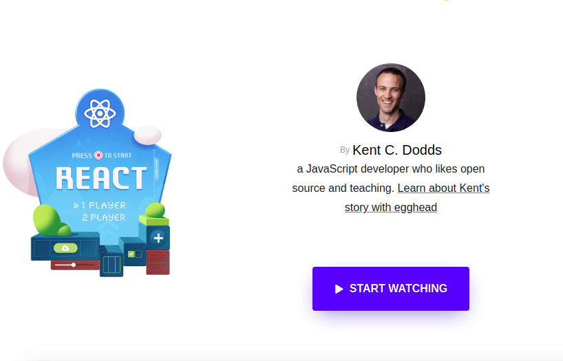

# React Codelab

React.js is one of the most popular UI library. This codelab is for React newbies and anyone looking to build a solid foundation. It’s designed to teach you everything you need to start building web applications in React right away. This codelab which is plagiarised from [Kent C. Doods](https://kentcdodds.com/) tutorial, [Introduction to The Beginner's Guide to ReactJS](https://egghead.io/lessons/react-introduction-to-the-beginner-s-guide-to-reactjs).

[](https://egghead.io/lessons/react-introduction-to-the-beginner-s-guide-to-reactjs)


The repo contains three folders, `codelab`, `exercise` and `exercise-final`.

**[codelab](codelab/01-document-create-element.md)** folder contains the introduction about the topic

**exericse** folder conatins the exercise need to be done

**exercise-final** folder contains the solution of the exericse

## 📲 Getting Started

1. Clone this repo

```bash
git clone https://github.com/alexakasanjeev/learn-react-codelab.git
```

2. Cd into the project

```bash
cd learn-react-codelab
```

3. Open codelab folder, and start following instructions

## 📣 Acknowledgements

* [Kent C. Doods](https://github.com/kentcdodds/)

